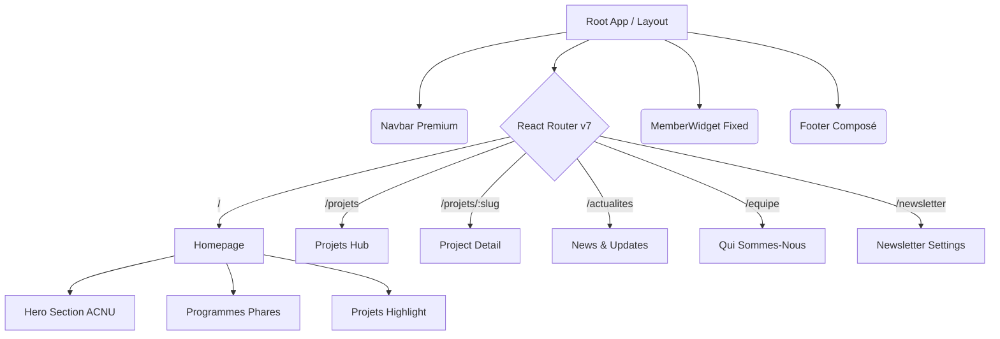

### 🧬 Technical Architecture & Gap Analysis

#### 1. Routing & Information Architecture
**Gap:** The PRD demands a multi-page setup (Homepage, `/actualites`, `/projets`, `/equipe`, `/newsletter`, member dashboard). The codebase is a 1-page `App.jsx` sequential render with no router (`react-router-dom` is missing from `package.json`).
**Action:** Implement `react-router-dom` and scaffold the explicit page structures.

#### 2. Design System & Theming (World-Class Identity)
**Gap:** Instead of a unified, premium ACNU identity (Bleu profond, doré prestige, etc. with African textures/Lion watermarks), the CSS implements a `ThemeSwitcher` toggling between 3 abstract styles (`diplomatic`, `organic`, `kinetic`).
**Action:** Nuke the generic Theme Switcher. Lockdown the UI to the **Official ACNU Palette** (Bleu `#07263B`, Doré `#F6C84B`, etc.) and typography pairings (Manrope + Inter + Playfair Display). Inject the Lion watermark and regional textures as core background layers.

#### 3. Content Integration & Components
| Component Zone | Current State (`acnu-app`) | Target State (`Projects/ACNU`) | Gap Severity |
| :--- | :--- | :--- | :--- |
| **Hero Section** | English placeholders ("Forming the Leaders of Tomorrow"), abstract GSAP images. | French "Ensemble, former...", specific ACNU pitch, CTA Don / Découvrir + Lion texture. | 🔴 High |
| **Programmes/Projets** | "Diagnostic Shuffler", "Telemetry Typewriter", "Protocol Scheduler" (Tech-heavy abstracts). | Cards for ICNU, Miss & Mister, Simulation, Maison des Jeunes, Acnumedia. | 🔴 High |
| **Actualités/News** | Non-existent. | Grid/Carousel of latest news + explicit page with filters. | 🔴 High |
| **Équipe Exécutive** | Non-existent. | Executive team profiles, photos, bios, governance roles. | 🔴 High |
| **Newsletter / Don** | Non-existent. | Frequency selection (hebdo/mensuel), multi-tier don flows. | 🔴 High |
| **Member Widget** | ✅ Implemented! FAB toggling to a search modal for "ACNU-123". | Fixed bottom-right sticky widget validating member matricules. | 🟢 Mind blowing! |

---

### 🗺️ Target System Architecture (Mermaid)

